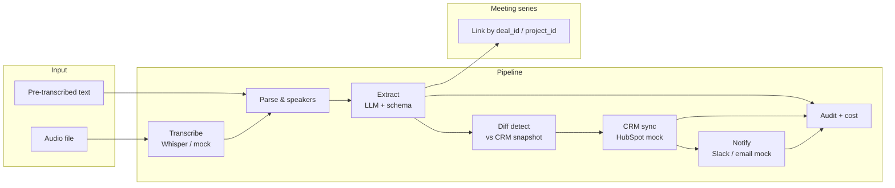

# AI Meeting Notes → CRM Auto-Sync

## Transcript → Extraction → CRM Update → Notifications

## 80% less manual CRM entry | Action item tracking | Configurable mapping

### The Problem

After every client call, salespeople need to update the CRM with action items, deal stage changes, next steps, and meeting notes. Most don't — or do it hours later from memory. CRM data is incomplete and inaccurate, making pipeline forecasting unreliable.

### The Solution

AI-powered meeting processing pipeline. Accepts audio (Whisper) or pre-transcribed text. Extracts structured data: attendees, action items with owners and deadlines, decisions, deal stage changes, next steps, sentiment. Syncs to CRM with diff detection (only updates changed fields, preserving manual edits). Meeting series tracking links related meetings by deal. Notifications via Slack on key events.

### Architecture



Diff detection runs **before** CRM write: desired fields from YAML mapping are compared to the current deal snapshot; only differing HubSpot properties are sent, so manual CRM edits on unchanged fields are preserved.

### Evaluation Results

Latest harness run (`make evaluate`, labeled gold JSON replay — see `docs/problem-definition.md` for methodology):

| Metric | Value |
|--------|-------|
| Test cases | 27 |
| Overall extraction accuracy | 1.00 |
| Action item detection rate | 1.00 |
| CRM mapping accuracy | 1.00 |
| Avg cost per meeting (USD) | ~0.0002 (mock tokenizer heuristic) |
| Total eval cost (USD) | ~0.006 |

Full JSON: `eval/results/eval_2026-03-30.json` (regenerated per run).

### Key Features

- Audio ingestion via Whisper API + pre-transcribed text support
- Rich extraction: attendees, actions (owner + deadline), decisions, deal stage, next steps, sentiment
- CRM diff detection: only update changed fields, preserve manual edits
- Configurable CRM field mapping (YAML — swap CRM without code changes)
- Meeting series tracking by deal ID
- Action item tracking with status (open/done/cancelled; overdue filter)
- Slack notifications on deal stage changes and new action items
- Evaluation pipeline with 25+ test transcripts (`eval/test_set.jsonl`)

### Tech Stack

Python 3.12, FastAPI, OpenAI API (Whisper + GPT-4o — pluggable; default mock LLM), PostgreSQL (Docker) / SQLite (local), HubSpot API (mock), Slack API (mock), Docker, GitHub Actions.

### How to Run

```bash
git clone https://github.com/afras23/meeting-notes-crm-sync.git
cd meeting-notes-crm-sync
cp .env.example .env   # Add API keys and DATABASE_URL as needed
docker compose up -d --build
# If 8000 or 5432 are taken: API_PORT=8001 DB_PORT=5433 docker compose up -d
# API: http://localhost:8000/docs
# Process a meeting (JSON body):
curl -s -X POST http://localhost:8000/api/v1/process \
  -H "Content-Type: application/json" \
  -d '{"text": "Speaker 1: Let us discuss the Q3 pipeline...", "deal_id": "deal-123"}'
# Run tests:
make test
# Run evaluation:
make evaluate
```

Local dev without Docker: `make install-dev`, `make run`, ensure `DATABASE_URL` points to SQLite or Postgres.

### Architecture Decisions

| Decision | Rationale |
|----------|-----------|
| Whisper for transcription | Industry standard, handles accents and noise |
| Diff detection before CRM sync | Prevents overwriting manual CRM edits |
| YAML field mapping | Switching CRM providers is a config change, not a rebuild |
| Meeting series by deal ID | Incremental context accumulation across calls |

See also `docs/decisions/` for ADRs.

### Documentation

| Doc | Purpose |
|-----|---------|
| [docs/architecture.md](docs/architecture.md) | Detailed pipeline and integrations |
| [docs/runbook.md](docs/runbook.md) | Operations and troubleshooting |
| [docs/problem-definition.md](docs/problem-definition.md) | Business context |
| [CHANGELOG.md](CHANGELOG.md) | Release phases |

### License

Proprietary / portfolio — see repository owner.
