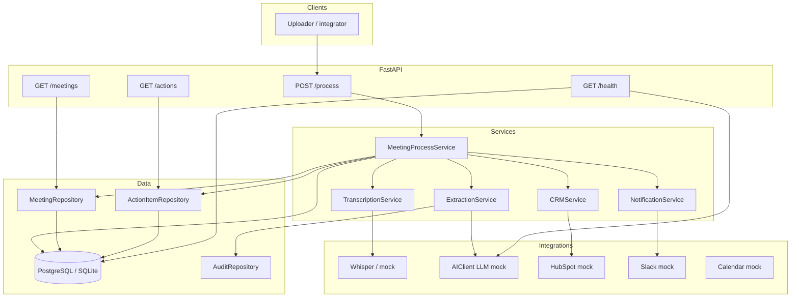
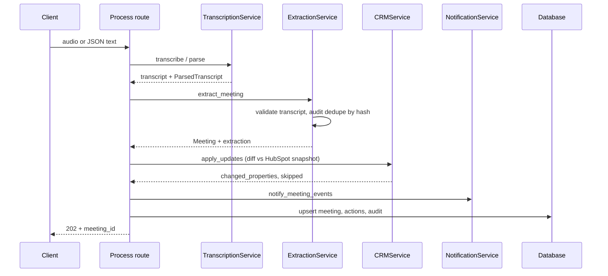

# Architecture

## System context

The service exposes a versioned HTTP API (`/api/v1`) that accepts meeting audio or text, runs an async processing pipeline, persists structured results, and optionally updates a CRM and sends notifications.

## Component diagram

## Request flow (process)

## Diff detection (CRM)

1. Load `config/crm_mapping.yaml` for the configured CRM key (e.g. `hubspot`).
2. Build **desired** deal fields from meeting JSON via each field’s `source` path.
3. Load **current** deal from `HubSpotClientMock.get_deal(deal_id)`.
4. `_diff_properties`: emit `changed` only where `current[key] != desired[key]`; skip `None` desired values.
5. If `changed` non-empty: `update_deal` with **only** `changed`, then attach a note. Retries use exponential backoff + jitter.

## Meeting series

`compute_meeting_series_id(deal_id, project_id)` derives a stable series id so related meetings can be listed and filtered by `deal_id` on `/meetings`.

## Non-functional

- **Correlation ID**: middleware attaches `X-Correlation-ID` for tracing.
- **Rate limiting**: configurable RPM on HTTP layer.
- **AI**: daily cost cap, timeout, retries with jitter on `TimeoutError`, circuit breaker on consecutive failures.
- **Lifespan**: DB engine disposed on shutdown.
